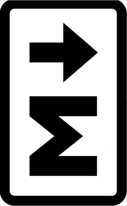

  
## 简介
**Markdown**是一种轻量级标记语言，一般用于博客文章的书写。  
**Markdown**兼容所有的文本编辑器和字处理软件，采用「标记」语法，来代替常见的排版格式，使我们把注意力集中在文字上，创作出一篇精美的文章。  
 
## 参考文档  
你可以从下列几处地方得到相当严谨、完整的**Markdown**书写标准：  
>1.[创始人Jhon Gruber的陈述](http://daringfireball.net/projects/markdown)  
>
2.[SegmentFault提供的语法指南](https://segmentfault.com/markdown)
>  
3.[网友整合的简体中文版](http://www.appinn.com/markdown)  

----
 
## 后日谈  
**Markdown**学习起来并不是很难，因为它的语法比起其他编程语言来说非常少，而且比较轻松、容易上手，还可以导出为HTML、PDF文件。如今，各种各样**Markdown**编辑器软件的出现给我们提供了很多额外的功能，你甚至可以仅仅使用文本内容来创作出流程图和时序图以及复杂的表格和公式。不过，我还是推荐使用专业的工具来完成这些东西，以体现出**Markdown**语言简洁的特性。  

个人比较喜欢用谷歌Chrome浏览器上的*Minimalist Markdown Editor*插件来辅助**Markdown**文件的预览、校验，但主要还是使用文本编辑器来进行写作，因为毕竟是写文章。  
 
>We believe that writing is about content, about what you want to say – not about fancy formatting.
>
>我们坚信写作写的是内容，所思所想，而不是花样格式。
>
>——— Ulysses for Mac