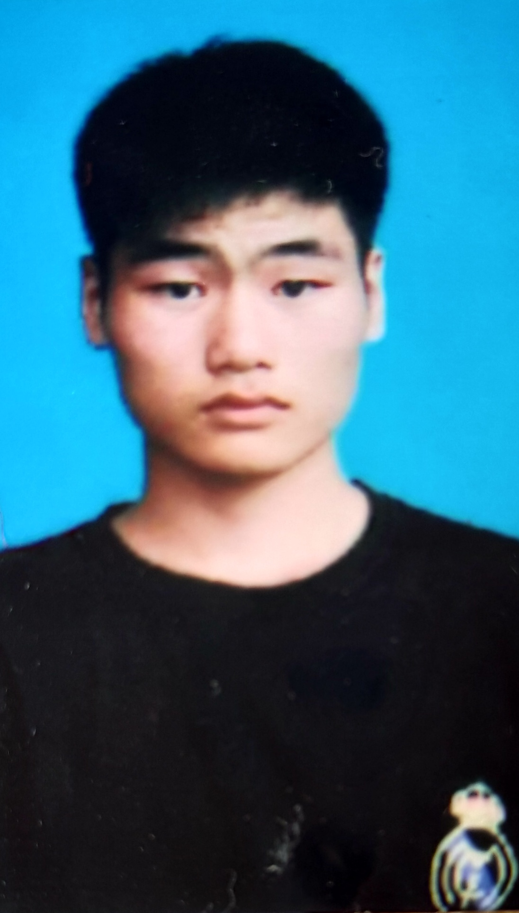

# 个人简历
 
  

### 基本信息
**王广庆**  
1997年5月23日 汉族  
>>>WEB前端开发、用户体验（UE/UX）设计  

联系方式 >>>>**15520487292**  
电子邮箱 >>>>**605383112@qq.com**  
---
成都理工大学，信息科学与技术学院，通信工程，2014级  

- 2017年暑期在麦如公寓管理有限公司实习了2个月，负责管理公司仓库的入库、出库以及物品的配送，还有房屋的配置整理。  

---

### 自我简介
目前还在读大学，18年毕业。HTML5+CSS都有学，AJAX和angularJS学习中，接下来准备学react或者vue。Photoshop缓慢学习中。

正式的项目经验还没有，动手完成了自己的[个人博客网站](https://initiate-spinach.github.io/kaze/)，跟着外网的一些教程做了简单的例子。

无宗教信仰，身体健康。入选过校读书会内务部2年，参与组织多场活动。  
老实敦厚，友善待人，对新技术感兴趣，适应力强。
